# Clothing Boutique System API

### [Ing. Israel Santiago](https://israelsantiago.com)

Project for the subject "Development and implementation of information systems". This is the demo repository that will be used as a guide for the development during the semester.

## Creation steps

This are the steps I have followed to create this project, I created this just for future references

#### 1. Create new Node.JS project:

```bash
npm init
```

This will create a new file `package.json` in the root of our directory, it may look similar to this:

```json
{
  "name": "api",
  "version": "0.0.1",
  "description": "backend for clothing boutique system",
  "main": "index.js",
  "scripts": {
    "test": "echo \"Error: no test specified\" && exit 1"
  },
  "author": "Israel Santiago",
  "license": "MIT"
}
```

#### 2. Creating the folder structure:

```
├── src
│   ├── common/
│   │   ├── index.js
│   ├── controllers/
│   │   ├── index.js
│   ├── database/
│   │   ├── index.js
│   ├── middlewares/
│   │   ├── index.js
│   ├── models/
│   │   ├── index.js
│   ├── routes/
│   │   ├── index.js
│   ├── utils/
│   │   ├── index.js
│   ├── index.js
├── .env
├── package.json
└── README.md
```

#### 3. Install all the main dependencies that we'll need for this project:

_Install normal dependencies_

```bash
pnpm add bcrypt body-parser cors date-fns dotenv express express-session jsonwebtoken morgan mysql2 sequelize uuid
```

_Install development dependencies_

```bash
pnpm add -D nodemon
```

#### 4. Then add a few new script in the `package.json` file:

```json
  "scripts": {
    "dev": "nodemon src/index.js", // <-- new script
    "test": "echo \"Error: no test specified\" && exit 1"
  },
```

Now the `package.json` should look like this (the versions of some dependencies may be different):

```json
{
  "name": "api",
  "version": "0.0.1",
  "description": "backend for clothing boutique system",
  "main": "index.js",
  "scripts": {
    "dev": "nodemon src/index.js",
    "test": "echo \"Error: no test specified\" && exit 1"
  },
  "author": "Israel Santiago",
  "license": "MIT",
  "dependencies": {
    "bcrypt": "^5.1.1",
    "body-parser": "^1.20.2",
    "cors": "^2.8.5",
    "date-fns": "^2.30.0",
    "dotenv": "^16.3.1",
    "express": "^4.18.2",
    "express-session": "^1.17.3",
    "jsonwebtoken": "^9.0.1",
    "morgan": "^1.10.0",
    "mysql2": "^3.6.0",
    "sequelize": "^6.32.1",
    "uuid": "^9.0.0"
  },
  "devDependencies": {
    "nodemon": "^3.0.1"
  }
}
```

#### 5. Finally, create our basic server

1. Go to `src/index.js` and create or first server:

```javascript
import "dotenv/config.js";
import express from "express";
import morgan from "morgan";
import cors from "cors";
import bodyParser from "body-parser";
import session from "express-session";
import { PORT, SECRET_KEY } from "./common";

const app = express();
app.use(morgan("dev"));
app.use(bodyParser.json());
app.use(bodyParser.urlencoded({ extended: true }));
app.use(session({ secret: SECRET_KEY, resave: true, saveUninitialized: true }));
app.use(cors({ origin: "*" }));

app.get("/", (req, res) => {
  res.status(200).json({
    message: `Welcome to Clothing Boutique\n
    Developed by: Israel Santiago`,
  });
});

app.listen(PORT, () => {
  console.log(`listening on PORT ${PORT}`);
});
```

2. Run our project:

```bash
pnpm run dev
```

3. Open your browser and to go `localhost:8000/`, you should see something like this:

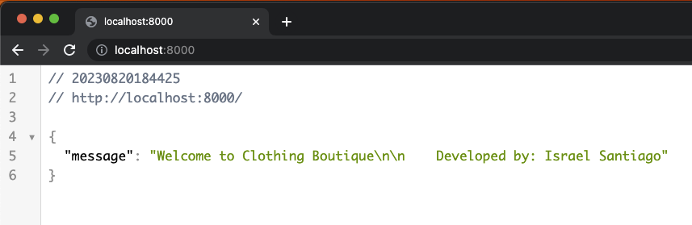

___
##### Commit and push this changes
```bash
git add . && git commit -am "basic nodejs server running" && git push origin
```
___
#### 6. Implement our first class to handle all the Server logic

Let's implement our first class, create a new file in `models/server.js`

```javascript
import express from "express";
import morgan from "morgan";
import cors from "cors";
import bodyParser from "body-parser";
import session from "express-session";
import { PORT, SECRET_KEY } from "../common";

class Server {

    constructor() {
        this.app = express();
        this.port = PORT;

        // Middlewares
        this.middlewares();

        // routes
        this.routes();
    }

    middlewares() {
        this.app.use(morgan("dev"));
        this.app.use(bodyParser.json());
        this.app.use(bodyParser.urlencoded({ extended: true }));
        this.app.use(session({ secret: SECRET_KEY, resave: true, saveUninitialized: true }));
        this.app.use(cors({ origin: "*" }));
    }

    routes() {
        this.app.get("/", (req, res) => {
            res.status(200).json({
                message: `Welcome to Clothing Boutique\n
              Developed by: Israel Santiago`,
            });
        });
    }

    listen() {
        this.app.listen(this.port, () => {
            console.log(`listening on PORT ${this.port}`);
        });
    }
}

export default Server;
```

Then go to our main `src/index.js` and let's call our new class here:
```javascript
import "dotenv/config.js";
import Server from './models/server';

const server = new Server();

server.listen();
```

To avoid people access to our main route (for security reasons), let's create a static html page.
Create a new file in `public/index.html` and add a basic html template
```html
<!DOCTYPE html>
<html lang="en">
<head>
    <meta charset="UTF-8">
    <meta name="viewport" content="width=device-width, initial-scale=1.0">
    <title>Access Denied</title>
</head>
<body>
    <h1>Access denied</h1>
</body>
</html>
```

Then in our Server class, inside the middlewares method, add a new one

```javascript
this.app.use(express.static('public'));
```

This will replace our main route `localhost:8000/`, now when you reload the page, will see this html page:

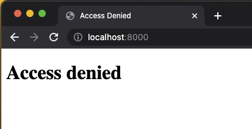

Now we can add another route to our routes method:

```javascript
this.app.get("/api", (req, res) => {
  res.status(200).json({
    message: `Welcome to Clothing Boutique API Developed by: Israel Santiago`,
    });
});
```

Now we have our server in a separated file, much better!

___
##### Commit and push this changes
```bash
git add . && git commit -am "adding first class to handle server logic" && git push origin
```
___

#### 7. Let's connect to our database

To do this, we need first to [run the MySQL Server](https://www.tutorialspoint.com/starting-and-stopping-mysql-server)

For Mac / Linux
```bash
sudo service mysqld start
```
Here's the easiest way (this is the one I do):
1. Go to system preferences on your mac and scroll down to the bottom

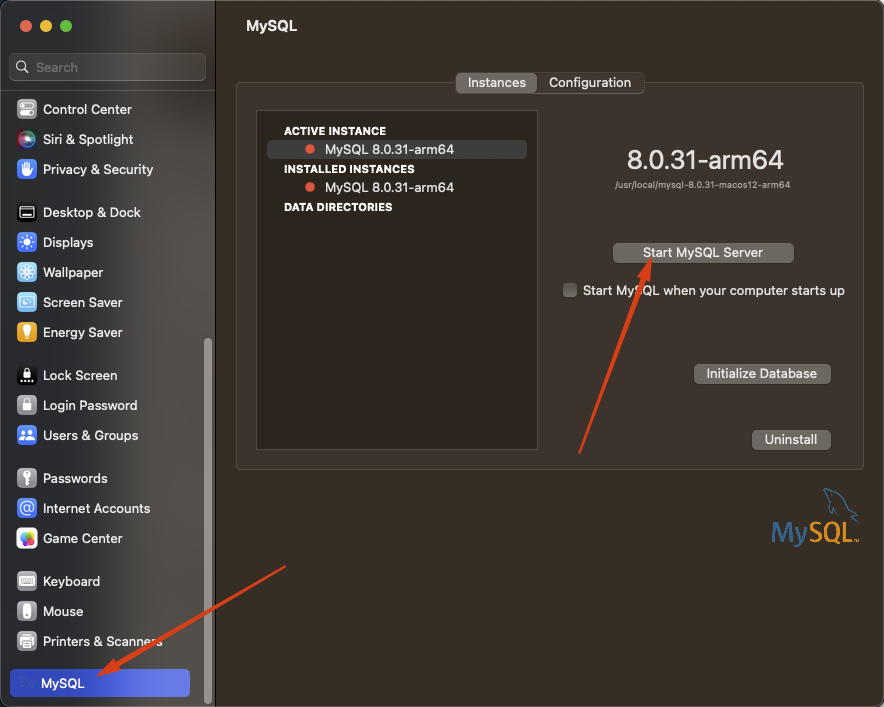

RUNNING:

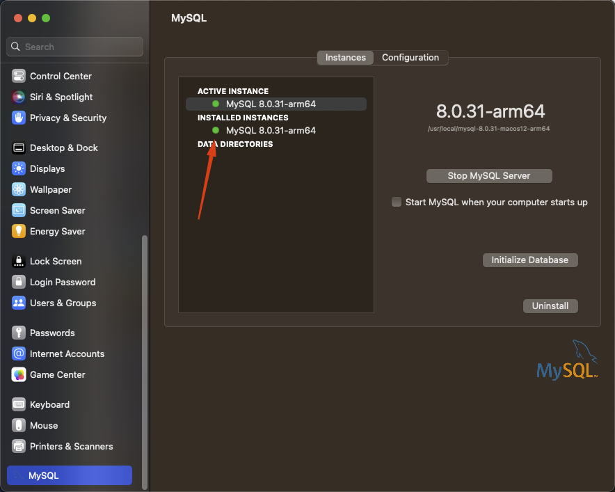

For Windows [follow this instructions](https://www.tutorialspoint.com/starting-and-stopping-mysql-server)
```bash
C:\> "C:\Program Files\MySQL\MySQL Server 8.0\bin\mysqld"
```

Now that we have our MySQL Server running, let's create our first connection, open [Table Plus](https://tableplus.com) 

1. Create a new connection:

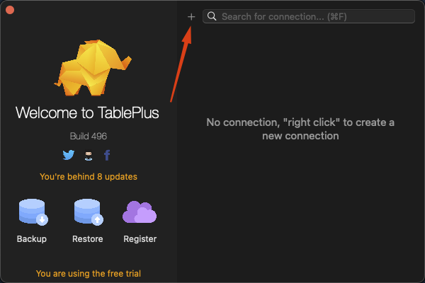

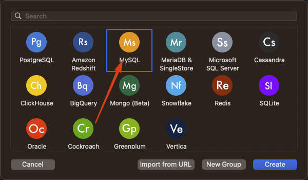

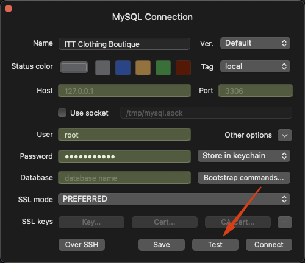

2. Create and connect to a new database

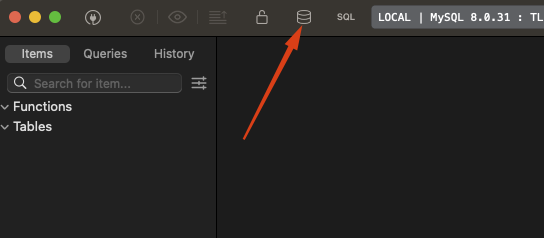

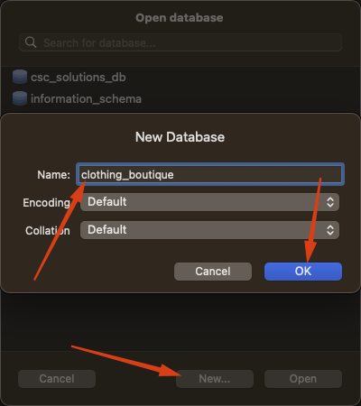

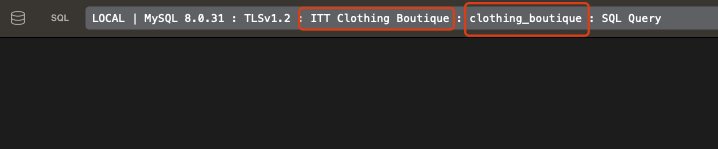

Now we have our database ready, let's communicate our project with the database.

First, add our database parameters to our `.env` file
```env
# database
DB_HOST=localhost
DB_USER=root
DB_NAME=clothing_boutique
DB_PASSWORD=your_password
```

> **_NOTE:_** Don't forget to pull the server down and then run it up again

In our `src/database/index.js` we'll create our db configuration

```javascript
import Sequelize from 'sequelize';

const db_host = process.env.DB_HOST || '';
const db_name = process.env.DB_NAME || '';
const db_password = process.env.DB_PASSWORD || '';
const db_user = process.env.DB_USER || '';

const db = new Sequelize(db_name, db_user, db_password, {
    host: db_host,
    dialect: 'mysql',
});

export default db;
```

In our `Server` class, let's create a new method that will try to make a connection to our database, if success will show a message, if error also will show a message to advise us about the error

```javascript
async dbConnection() {
       try {
           await db.authenticate();
           console.log('database connected');
       } catch (error) {
           console.log("Couln't connect to database");
       }
   }
```

and add it to the constructor
```javascript
constructor() {
      this.app = express();
      this.port = PORT;

      // database connection
      this.dbConnection();
      ...
  }
```

Congrats! We are now connected to our database!

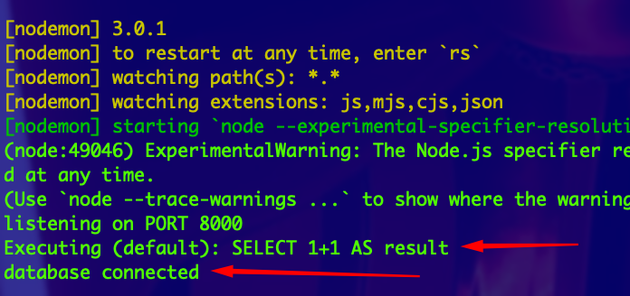

___
##### Commit and push this changes, and create the PR
```bash
git add . && git commit -am "connecting to database" && git push origin
```
___

#### 8. Finally, let's create the very first database model

Since we'll handle different registers in the database, as engineers we should think for possible missing things in the requirements. What happen if our client want to delete a user, or a category but it already has relationships to other tables? it would brake our system. So let's first create some `status` and `models` values in `src/common/db-values.js`:
```javascript
// values for model status
export const STATUS_VALUES = Object.freeze({
  ACTIVE: 1,
  DISABLED: 2,
  DELETED: 3,
});

/* A model object that will contain the name of every model in the database, with the following structure:
key (name for us to identify in code) : value (name that the table will have in the database)
*/
export const MODEL = Object.freeze({
  Category: 'categories',
});
```

Now create a new file under `models` to add our first `category` model
```javascript
import { STATUS_VALUES, modelNames } from '../common';
import { DataTypes } from 'sequelize';
import { handleValidateDBError } from '../utils';

export default (sequelize) => sequelize.define(
    modelNames.Category,
    {
        id: {
            type: DataTypes.UUID,
            primaryKey: true,
            allowNull: false,
            unique: true,
            defaultValue: DataTypes.UUIDV4
        },
        name: {
            type: DataTypes.STRING,
            allowNull: false,
            unique: true,
        },
        status: {
            type: DataTypes.TINYINT,
            allowNull: false,
            defaultValue: STATUS_VALUES.ACTIVE,
            validate: {
                isIn: {
                    args: [[STATUS_VALUES.ACTIVE, STATUS_VALUES.DELETED, STATUS_VALUES.DISABLED]],
                    msg: 'Invalid status value provided',
                },
            },
        },
    }
);
```

Now we need to register our new model in sequelize, but how? Creating a helper function that will register our models for us, create a new file in `database/db-helpers.js`:
```javascript
import db from '.';
import categoryModel from '../models/category';

let models;

export const registerModels = () => {
    models = {
        Category: categoryModel(db),
    };
};

```

Now we need to run that function, but where? Yes! In our Server class, add a new `validateTables()` method and add it to the `dbConnection()` method:
```javascript
async validateTables() {
    registerModels();
}
```
```javascript
async dbConnection() {
    try {
      await db.authenticate();
      await this.validateTables(); // <-- here is it, after the auth
      console.log('database connected');
    } catch (error) {
      console.log("there was an error: ", error);
    }
}
```

Now, we need to create our new table with the actual database, in the previous step we *ONLY* registered the model in the sequelize global object of our project, but it hasn't been added to the database. `Sequelize` provides a method to sync our models with the database:
```javascript
async syncModels(force = false, alter = false) {
    const options = { force, alter }; // force: delete if table exists, alter: alter current table structure, for example, if a new property has been added
    await db.sync(options); // <-- this is the method
    console.log('All tables were synced :)');
}
```

Finally, just add this `syncModels()` to the `validateTables()`:
```javascript
async validateTables() {
  registerModels();
  await this.syncModels(); // <-- here is it, after register the models of course
}
```

If everything goes well, we'll see the `console.log` from `syncModels()`:

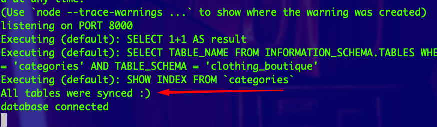

if you want to fully make sure of this, go and check the database in Table Plus:

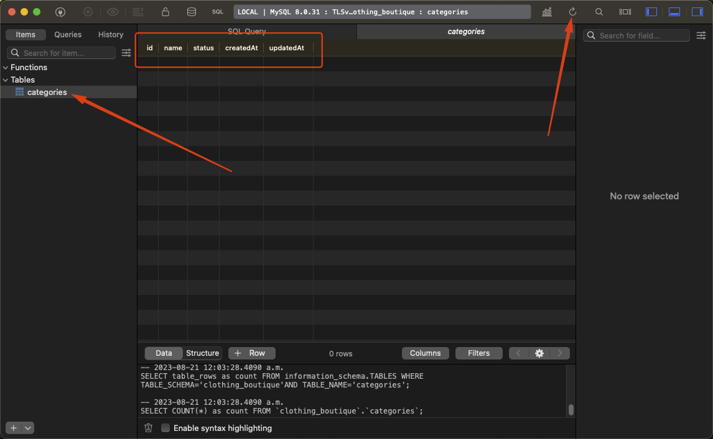

___
##### Commit and push this changes, and create the PR
```bash
git add . && git commit -am "create database model for categories" && git push origin
```
___